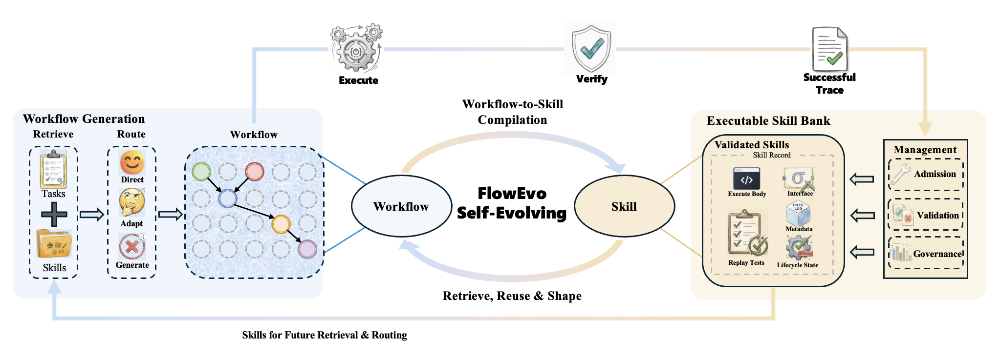

# FlowEvo

**Self-Evolving Agents through the Co-Evolution of Workflows and Executable Skills**

Published as a conference paper at the Third Conference on Language Modeling
(COLM) 2026.

**Paper:** [COLM 2026 (OpenReview)](https://openreview.net/forum?id=hU2N7IIkcE)
&nbsp;|&nbsp; [arXiv:2607.21596](https://arxiv.org/abs/2607.21596)



FlowEvo is a training-free framework for agents that improve over time by
compiling successful execution traces into reusable, directly-executable skills,
then routing future tasks to the cheapest-yet-reliable path: direct skill
replay, skill-conditioned workflow generation, or pure dynamic planning. A
governance layer continuously evaluates whether injected skills help or hurt
and suppresses those that cause negative transfer.

This repository contains the public release of the FlowEvo codebase accompanying
the paper.

## Repository layout

- `src/agent/` — planner, generator, executor, retriever
- `src/compiler/` — trace-to-skill compilation and admission
- `src/memory/` — skill registry, policy, template, primitive, and trace stores
- `src/governance/` — contrastive evaluation and utility scoring
- `src/maintenance/` — governance kernel that coordinates lifecycle updates
- `src/runtime/` — LLM client, generation settings, and config loader
- `src/core/` — shared schemas and utilities
- `src/env/` — sandbox helpers for code execution
- `src/eval/` — benchmark runner (`runner.py`) and verifier (`verifier.py`)
- `src/alfworld_/` — ALFWorld environment adapter, executor, compiler, and
  validation entry (`run_20task_validation.py`)
- `src/code_math/` — HumanEval / MBPP / GSM8K / MATH benchmark runner
- `configs/` — runtime configuration templates

## Setup

```bash
python -m venv .venv
source .venv/bin/activate
pip install -e .
```

### Configuring the LLM backend

The runtime talks to any OpenAI-compatible chat-completions endpoint through
the `openrouter` provider. `configs/default.yaml` targets
`openai/gpt-4o-mini` via OpenRouter, the shared backbone used in the paper;
point `base_url` / `model` at another endpoint to switch backbones.

Create a local override that is never committed:

```bash
cp configs/local.example.yaml configs/local.yaml
# edit configs/local.yaml to set your api_key
```

The API key can also be supplied via the `OPENROUTER_API_KEY` environment
variable.

## Running code / math benchmarks

```bash
python -m src.code_math.runner \
    --benchmark humaneval \
    --config-path configs/default.yaml \
    --output-dir runs/humaneval_demo \
    --conditions cot_baseline ours
```

Supported benchmarks: `humaneval`, `mbpp`, `gsm8k`, `math`.

Supported conditions: `io_baseline`, `cot_baseline`, `full_library`, `expel`,
and `ours` (FlowEvo's compile + reuse + adaptive-escalation pipeline).

## Running ALFWorld

```bash
python -m src.alfworld_.run_20task_validation \
    --config-path configs/default.yaml \
    --output-dir runs/alfworld_demo \
    --conditions full_library
```

Supported ALFWorld conditions: `pure_dynamic`, `compile_only`, `layer1_only`,
`layer1_2`, `layer1_3`, `full_library`, `expel`, and `no_governance`.

## Citation

If you use FlowEvo in your research, please cite our paper:

```bibtex
@inproceedings{ren2026flowevo,
  title         = {FlowEvo: Self-Evolving Agents through the Co-Evolution of Workflows and Executable Skills},
  author        = {Ren, Zeyu and Yue, Ling and Li, Ran and Wang, Yishu and Xu, Shengxiang and Liu, Hanmo and Pan, Shaowu and Di, Shimin},
  booktitle     = {Third Conference on Language Modeling (COLM)},
  year          = {2026},
  address       = {San Francisco, CA, USA},
  url           = {https://openreview.net/forum?id=hU2N7IIkcE},
  eprint        = {2607.21596},
  archivePrefix = {arXiv},
  primaryClass  = {cs.AI}
}
```

COLM proceedings are published on OpenReview and are not assigned DOIs, so the
entry carries the OpenReview `url` in place of a `doi` field.

## 本地 DeepSeek 和数据集

本目录下载自官方仓库，基准提交为 `36e81efd4d1fdbabca7366200b15808ebef157fa`。已安装独立的 Python 3.10.12 虚拟环境 `.venv`，依赖版本记录在 `requirements.lock.txt`。重新安装可运行：

```bash
python3 -m venv .venv
.venv/bin/python -m pip install -r requirements.lock.txt -e .
```

运行一题 GSM8K，使用官方 `ours` 条件和 `deepseek-flash`：

```bash
.venv/bin/python scripts/run_deepseek_one.py
```

脚本从项目父目录的 `miyao.txt` 读取密钥，通过子进程环境变量传给官方运行器；不将密钥写入配置或日志。每次运行建立独立的 `runs/deepseek_gsm8k_one_<北京时间>/` 目录，保存日志、结果摘要、CSV 和带成功解答库的检查点。只有 1 题通过时脚本才返回退出码 0。

DeepSeek 配置位于 `configs/deepseek.yaml`。配置中的 `provider: openrouter` 是上游对 OpenAI 兼容接口的内部名称；实际请求地址为 `https://api.deepseek.com`。本次保留上游解题提示词、答案校验、重试和解答入库逻辑。

### 已下载的数据集

| 数据集 | 上游来源 | 训练集 | 测试集 | 本地目录 |
|---|---|---:|---:|---|
| GSM8K（main） | `openai/gsm8k` | 7,473 | 1,319 | `data/datasets/gsm8k/` |
| MATH（全部 7 个类别） | `EleutherAI/hendrycks_math` | 7,500 | 5,000 | `data/datasets/math/` |

每个目录含原始文件 `raw/<类别>/*.parquet` 和可直接读取的 `train.jsonl`、`test.jsonl`。`data/datasets/manifest.json` 记录下载源、固定版本、分项样本数和 SHA-256。下载采用 `src/code_math/loader.py` 指定的数据版本，MATH 为完整数据集。

可重跑下载与完整性检查：

```bash
.venv/bin/python scripts/download_math_gsm8k.py
```

本地适配使加载器优先使用 `data/datasets/` 下的原始 Parquet；可通过 `FLOWEVO_DATASET_DIR` 指定其他目录。MATH 任一类别缺失或加载失败会明确报错，避免上游静默跳过导致少算样本。本地 GSM8K 和 MATH 的全部测试题均已在 Hugging Face 离线模式下成功加载。

已移除 `CodeSkillLibrary.retrieve()` 中对 GSM8K/MATH 禁用 skill 上下文的特殊分支。在 `ours` 和 `full_library` 条件下，这两类任务也会检索同一数据集内的成功解答；关键词重合数大于 3 时，将最相似解答注入解题提示词，并供启用重试的条件使用。空库或无满足阈值的解答时不会注入，因此从空库只跑第一题不能验证跨题注入。

单题运行用于验证 API、官方数学题运行器、校验及成功解答入库，不能验证跨题技能复用或复现论文的整体指标。

### 本次单题结果

实测目录：`runs/deepseek_gsm8k_one_20261009_170111_336099/`。

- 题目：`gsm8k_0`，每天 16 个鸭蛋，吃掉 3 个、烘焙用 4 个，剩余每个卖 2 美元。
- DeepSeek 答案：`18`；标准答案：`18`；独立算术校验：`(16 - 3 - 4) * 2 = 18`。
- 官方运行器结果：1/1 PASS，0 次重试，282 tokens，成功解答库大小为 1。
- `run.log` 为运行日志；`summary.json` 为官方统计；`_checkpoint_gsm8k_ours.json` 包含原始解答及解答库；`verification.json` 为独立校验和环境记录。
