# 架构和数据边界

## 一、集成范围

FlowEvo 的数学 base prompt、同 benchmark 历史解答文本检索模式和成功轨迹持久化思想被保留。`vendor/flowevo` 保留本地原生源码快照，HumanEval/MBPP 的离线执行验证有独立测试。新求解路径不直接调用原来的 `verify/run_condition`，因为它们可把 gold 正误作为 retry 控制信号。

BoT 提供 Thought Distillation 和 MetaBuffer 的设计来源。新 distiller 接收多个合法成功轨迹，一簇一次结构化生成。没有为每道测试题运行 BoT 的多阶段流程，也没有强制 embedding/LightRAG 依赖。

新增组件：可版本化 StrategyBank、Subject 分类、结构特征、独立 paired admission、成本预测、严格分开的评分接口、逐调用 ledger、冻结提交和带内容约束的 checkpoint。

## 二、主数据流

```mermaid
flowchart LR
  T[train-build public problems] --> S[Gold-blind MathSolver]
  S --> F[Sealed submissions]
  L[Separate train labels] --> E[Offline Evaluator]
  F --> E
  E --> C[Clean first-pass trace pool]
  C --> G[Subject and structural clustering]
  G --> D[One distillation call per cluster]
  D --> B[Candidate bank]
  B --> V[Paired independent train-dev solves]
  V --> A[Admission with cost and harm evidence]
  A --> FB[Frozen bank]
  P[Test ProblemView only] --> R[Retriever and cost router]
  FB --> R
  R --> Q[Base / compact strategy / narrow exact execution]
  Q --> FF[All answers sealed]
  FF --> EE[Offline test evaluator]
  TL[Separate test labels] --> EE
```

## 三、接口职责

| 文件 | 职责 |
|---|---|
| `schemas.py` | extra=forbid 的 ProblemView/EvaluationRecord、SkillRecord、Trace、Submission、TokenCall |
| `taxonomy.py` / `features.py` | 七类映射、metadata 来源、无 LLM 的保守分类、题面触发条件、近重复检查 |
| `trace_collector.py` / `provenance.py` | 首轮 train-build 来源证据、gold/reference 字段检测、旧库来源隔离 |
| `thought_distiller.py` | 主学科、题面结构、初步标签和解题共同变换聚类；多轨迹生成/修订 |
| `strategy_bank.py` | 版本、hash、保存/加载、去重、合并、拆分和状态维护 |
| `skill_validator.py` | 相同 dev 题的 base/skill 配对生成；完成后才评分；统计四格表与成本 |
| `skill_retriever.py` | 同学科、active 状态、触发/前提/负触发、提示预算过滤 |
| `cost_router.py` | dev 均值、节省下界、正确性风险上界、query 长度范围检查 |
| `prompt_builder.py` | 原生数学 base 格式、紧凑策略、共享输出要求、无 gold 格式修复 |
| `math_solver.py` | 七种模式切换；不接收 evaluator；冻结后返回 Submission |
| `math_executor.py` | 默认关闭的完整算术表达式求值；不执行模型生成代码 |
| `evaluator.py` | seal 校验后读取 labels；平衡花括号提取；保守数值/文本匹配 |
| `token_accounting.py` / `runtime/llm_client.py` | 每次请求 usage、缺失估计、预算、缓存、失败账目、显式 API 授权 |
| `checkpoint.py` | 原子保存、配置/bank/split/manifest/模拟标志绑定、重复运行保护 |
| `data.py` / `code_math/loader.py` | 分层/重复题组划分、公开题面与私有标签分文件 |
| `workflows.py` / `cli.py` / `reporting.py` | 命令行编排、建库、冻结评测、逐题和配对成本输出 |

## 四、正确性和 gold 隔离

`MathSolver.solve` 要求精确的 `ProblemView` 类型，字段白名单不含答案或参考解。题面文件没有 labels。Retriever/Router 只接收该类型，动态特征来自题面；学科标签只使用公开 type。

Solver 没有评分器句柄。首次答案正确与否不会改变求解路径；只在无法提取规定的最终答案字段时按预先预算进行格式修复。即使一个格式正确的答案显然与 gold 不同，也不会由 gold 触发重试。`base_onepass` 严格只生成一次。

所有 Submission 带内容 seal，持久化后 evaluator 才打开标签。评分输出为布尔正确性和 `correct/incorrect`，不返回 gold 文本，且评分只由外部编排在整批完成后调用。checkpoint、请求日志和策略只保存 solver 已见内容。

自动来源校验拒绝 test/dev、非首轮、gold/reference 曝光、无证据或未独立判对的训练轨迹。还有诊断文本检测：`gold=...`、`gold_answer:...`、`reference_solution:...` 等会污染来源。此检测不等价于对任意不可信文本的完整信息流证明；主要保障来自数据接口隔离和执行顺序。

## 五、Skill 生命周期和 admission

每条新策略均为 candidate。必须先有至少 3 个不同 task ID、规范化题面不同的 clean train-build 首轮正确轨迹。distiller 允许 `no_generalizable_skill`，不强制生成。过长 compact prompt、不可观察触发器、遗漏声明条件/例外会被拒绝；`revise` 可用一次新的调用重新压缩，再重新验证。

同学科 trigger Jaccard 与步骤相似度用于候选去重。合并需要重新蒸馏，并清空验证统计/certificate；拆分需要收窄 trigger 范围，子策略均回到 candidate。维护显式支持 retain、修订、quarantine、retire，冻结评测不调用维护。

dev 来源须独立：task ID、数字掩码规范化题面、前后缀 blocking + SequenceMatcher>=0.9 的明显近重复检查。验证样本中仅数字变化的重复结构不重复计入有效样本。对完整 base/skill 请求分别计数，允许的格式修复也算成本。

默认有害观测直接 quarantine；有效样本不足、无净收益或缺来源保持 shadow。达到 min_dev 条件的 active 仍不等于统计非劣证明。成本 router 会进一步使用 Wilson 上/下界和置信度过滤，10 个 dev 样本在默认 1% 风险限下通常仍会被跳过。

Admission certificate 是内容一致性校验，不是签名或对恶意文件编辑者的认证。每次加载与 add 重新验证，修改 active skill 的内容会使 certificate 失效。

## 六、成本、复用和实验开关

默认最多注入一条策略。`top_k` 控制检索候选；`max_injected_skills=2` 只在固定检索实验中允许双方 composition_tags 同意的组合。成本路由仍只选择一条：没有联合 dev 证据时不推测组合成本。

`allow_skip_skill=false` 或 `cost_aware=false` 可作为显式消融开关，使完整模式退到 active 策略的固定检索；不能把这种运行报告为未经消融的成本感知方法。配置 hash 和 route reason 留档。

所有预测来自 paired dev，不额外调用路由 LLM。不足样本、题长超出校准范围、预期节省/下界不正、正确性风险超限时选择 Base。100 token 提示预算采用 UTF-8 bytes/3 估计，日志明确 estimated。真实 API 的 usage 优先用于实际成本，不把这一估计当成供应商 tokenizer。

Route C 为第二优先级实现：只接受完整匹配的 `Compute/Calculate/Evaluate` 整数四则式，使用受限 AST 和 Fraction。它可以证明这类完整任务；一般方程、几何或符号子过程不在覆盖范围内，直接回 Base，未伪造通用符号验证器。
