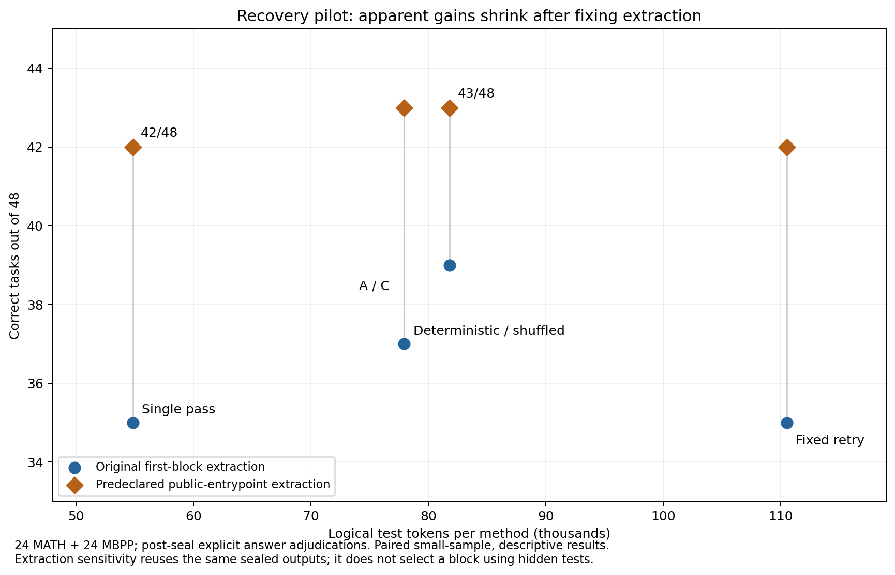

# 一次冻结确认：24 MATH +24 MBPP

| 方法 | MATH /24 | 代码 /24 | 总正确 /48 | 准确率 | 输入tokens | 输出tokens | 总tokens | 调用 |
| --- | --- | --- | --- | --- | --- | --- | --- | --- |
| 单次解答 | 19 | 16 | 35 | 72.92% | 5891 | 48960 | 54851 | 48 |
| 固定独立重试 | 19 | 16 | 35 | 72.92% | 11782 | 98755 | 110537 | 96 |
| 确定性失败后重试 | 20 | 17 | 37 | 77.08% | 7637 | 70305 | 77942 | 60 |
| A 失败感知控制器 | 20 | 19 | 39 | 81.25% | 10896 | 70940 | 81836 | 60 |
| C 冻结恢复经验 | 20 | 19 | 39 | 81.25% | 10896 | 70940 | 81836 | 60 |
| 打乱经验 | 20 | 17 | 37 | 77.08% | 7637 | 70305 | 77942 | 60 |

表中主结果包含封存后的3个显式显式复核：October30的两个输出与四次单位根的一个列表输出均正确。复核由本助手依据题目与数学证据完成，并非独立人工盲审。冻结自动评分器未改动；自动评分原表保存在 snapshots/task_results_automatic.jsonl，复核证据在 evidence/manual_adjudications.jsonl。自动下界为单次34、固定重试34、确定性36、A/C37、打乱36；分别有1、1、1、2、2、1个未知。

首轮13失败、35正确。固定重试救回2题同时损害2题，净增0；确定性重试救回2、损害0；A/C救回4、损害0。确认动作均有真实输出，288个题×方法结果全部完整。独立重试的同一输出供固定/确定性/打乱调用相同动作时共享；相同A/C动作也共享。这里的共享降低实验物理调用数，不代表方法部署可不支付自己的模型成本。

| 预定代码提取敏感性视图 | 单次 | 固定重试 | 确定性 | A | C | 打乱 |
| --- | --- | --- | --- | --- | --- | --- |
| 代码正确 /24 | 23 | 23 | 23 | 23 | 23 | 23 |
| 合计正确 /48 | 42 | 42 | 43 | 43 | 43 | 43 |

以上只离线重评同一封存输出，提取器按公开入口函数名取首个定义块，不根据隐藏测试试出最佳块。主表未被替换，控制器没有重跑。它表明A相对确定性重试的表面额外收益来自提取接口，而非错误算法修复。

逐题证据见 task_pairwise.csv、task_results.jsonl 与 evidence/confirmation_attribution.csv。48题不是历史500的重新测试，也不能由此声称总体准确率稳定提升。

本轮是选择性小样本，MATH 为训练集 Level4/5 新首轮输出，代码为 MBPP 非官方测试区题目。二者均与本轮 Memory 来源分开，且排除历史500测试题；此前项目可能看过题面/标签或使用过 MBPP 训练题，因此不声称全局从未曝光。一次动作样本不足以判断某方法“稳定”或“必须”有效。

